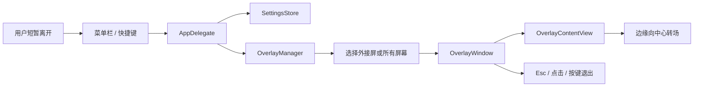

# 黑码码（VibeBlank）

> 短暂离开工位时，遮住屏幕内容，让智能体、构建、终端和本地服务继续跑。


黑码码是一个轻量 macOS 菜单栏工具。它面向正在用外接显示器写代码、跑 agent、跑构建或守着终端任务的人：你只是离开 5 到 10 分钟，不想锁住或中断电脑，也不想让外接屏继续展示代码、需求、聊天窗口或内部系统。

它会在选定屏幕上盖一层全屏黑色遮罩，底层应用继续运行。它是视觉隐私辅助工具，不是系统锁屏、身份验证工具或显示器电源管理工具。

## 用户故事

| 场景 | 黑码码怎么帮忙 |
| --- | --- |
| 我在跑一个长时间 coding agent，想去倒水 | 一键遮住外接屏，agent 和终端继续运行 |
| 我接了外接显示器，不想反复拔插 | 默认只遮外接屏，内置屏保持正常 |
| 我处理的内容比较敏感 | 可切换为遮住所有显示器 |
| 我回来后想快速恢复 | 菜单栏、快捷键、Esc、点击或按键都可以作为退出方式 |
| 我想确认工具正在工作 | 可选择纯黑、时间、状态文字或自定义文字 |

## 核心功能

| 功能 | 说明 |
| --- | --- |
| 遮住外接屏 | 默认只覆盖外接显示器，适合短暂离开座位 |
| 遮住所有屏幕 | 在更敏感的场景下覆盖所有显示器 |
| 拦截输入 | 遮罩窗口消费鼠标和键盘事件，避免误点到底层应用 |
| 安全退出 | Esc 始终可退出黑屏，作为兜底路径 |
| 快捷触发 | 菜单栏和 Control + Option + Command + B 都可切换黑屏 |
| 自定义显示 | 支持纯黑、时间、状态文字和自定义文字 |
| 渐变转场 | 开启和退出时使用从边缘向中心推进的转场 |
| 中文界面 | 菜单、设置页和遮罩状态文案使用中文品牌「黑码码」 |
| 小黑马图标 | 提供 app 图标和菜单栏 template 图标 |

## 不解决什么

| 不做 | 原因 |
| --- | --- |
| 不替代 macOS 锁屏 | 黑码码只解决视觉暴露，不做身份验证 |
| 不关闭显示器电源 | V2 仍然通过软件遮罩实现，避免硬件兼容问题 |
| 不监听 agent 状态 | 飞书通知、任务完成提醒属于后续方向 |
| 不做触发角 | 触发角计划在后续版本评估 |
| 不做 notarize | 目前面向本地打包和同事试用 |

## 使用方式

1. 打开 `dist/VibeBlank.app`。
2. 第一次启动时查看「黑码码设置」。
3. 从菜单栏点击小黑马图标，选择「开启黑屏」。
4. 使用菜单栏、Control + Option + Command + B 或 Esc 退出。
5. 在设置里选择「仅外接显示器」或「所有显示器」。

如果本地构建没有 notarize，macOS 首次打开时可能需要右键选择「打开」。

## 架构概览



## 技术栈

| 层 | 技术 | 用途 |
| --- | --- | --- |
| App shell | AppKit | 菜单栏、窗口、应用生命周期 |
| UI | SwiftUI | 设置页和遮罩内容渲染 |
| 快捷键 | Carbon HIToolbox | 注册全局快捷键 |
| 屏幕识别 | CoreGraphics | 区分内置屏和外接屏 |
| 设置存储 | UserDefaults | 保存覆盖范围、显示内容和触发设置 |
| 构建 | Swift Package Manager | 管理 target、构建和检查 |
| 打包 | shell scripts | 生成 `.app`、`.zip` 和图标资源 |

## 项目结构

| 路径 | 说明 |
| --- | --- |
| `Sources/VibeBlank/` | macOS app、菜单栏、遮罩窗口、设置 UI |
| `Sources/VibeBlankCore/` | 可测试的设置模型和持久化逻辑 |
| `Checks/VibeBlankCoreChecks/` | 不依赖 XCTest 的核心行为检查 |
| `assets/` | 小黑马 SVG、菜单栏图标和 `.icns` |
| `scripts/generate_icon.sh` | 从源图生成 app 图标和菜单栏图标 |
| `scripts/package_app.sh` | 构建 release 二进制并打包 `.app` / `.zip` |
| `docs/` | V1/V2 需求和技术方案 |

## 构建与验证

```bash
swift run VibeBlankCoreChecks
swift build --product VibeBlank
bash scripts/generate_icon.sh
bash scripts/package_app.sh
```

打包后会生成：

```text
dist/VibeBlank.app
dist/VibeBlank.zip
```

更详细的设计和实现背景见：

| 文档 | 内容 |
| --- | --- |
| [`docs/vibeblank-v2-requirements.md`](docs/vibeblank-v2-requirements.md) | V2 需求、用户场景、验收标准 |
| [`docs/vibeblank-v2-technical-solution.md`](docs/vibeblank-v2-technical-solution.md) | V2 架构调整、状态机、打包方案 |
| [`docs/vibeblank-v1-technical-solution.md`](docs/vibeblank-v1-technical-solution.md) | V1 技术方案 |

## 验收建议

| 用例 | 期望结果 |
| --- | --- |
| 默认开启黑屏 | 只遮外接屏，内置屏保持正常 |
| 切换到所有显示器 | 所有屏幕都被遮住 |
| 按 Esc | 黑屏退出，底层应用恢复可见 |
| 开启点击退出 | 点击遮罩后退出，点击不穿透到底层应用 |
| 开启按键退出 | 任意键退出，按键不传给底层应用 |
| 选择自定义文字 | 黑屏上显示自定义提示 |
| 打包 `.app` | `Info.plist` 显示名为「黑码码」，包含 `heimama-icon.icns` |

## 当前边界

黑码码适合减少路过视线看到屏幕内容的风险。如果你需要离开较久、内容高度敏感，或需要防止他人操作电脑，请使用 macOS 锁屏或公司要求的安全方案。
